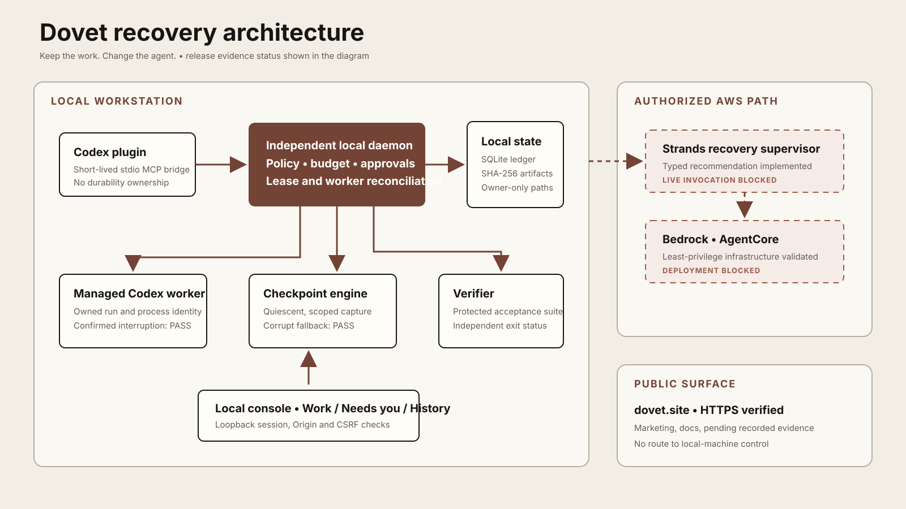

# Dovet

**Keep the work. Change the agent.**

Dovet is a local-first supervisor for recovering interrupted, explicitly managed coding-agent work. It preserves selected working state, asks a Strands agent for a bounded recovery recommendation, enforces permissions and budget in deterministic code, starts an authorized replacement worker, and independently verifies the result.

Dovet does not rotate ChatGPT accounts, recover private model reasoning, capture unsaved editor bytes, control arbitrary Codex Desktop sessions, or promise execution while a local machine sleeps.

The implementation is being built against the immutable specification in `handoff/`. Current evidence and blockers live in `docs/BUILD_STATE.md`, `docs/CAPABILITIES.md`, and `docs/BLOCKERS.md`.



## Development

Prerequisites: Python 3.12, uv, Node 24, pnpm 11, Git, and FFmpeg.

```sh
pnpm setup
pnpm doctor
pnpm test
pnpm build
```

Read the supported Codex usage snapshot without accessing authentication files:

```sh
uv run dovet usage --json
```

Validate or restore a portable checkpoint bundle without overwriting an existing directory:

```sh
uv run dovet bundle verify /path/to/checkpoint.dovet
uv run dovet bundle restore /path/to/checkpoint.dovet --to /new/recovery/directory
```

The importer validates the checkpoint schema, snapshot digest, handoff text, archive paths, file
allowlist, object sizes, and every SHA-256 hash before writing any object into the local store.

Live-provider tests are opt-in and require an approved Dovet policy and funded budget:

```sh
DOVET_LIVE_BEDROCK=approved \
DOVET_PRICE_CARD=artifacts/private/nova-micro-price-card.json \
pnpm test:integration
```

Without the explicit live flag, the provider test is reported as skipped and sends no request.

The local daemon binds to loopback, stores operational truth in SQLite, and uses a separate app-data directory for immutable artifacts and managed worktrees. The Codex plugin is a short-lived MCP bridge; it is not the durability layer.

The current public documentation site is [dovet.site](https://dovet.site). A successful live
Strands/Bedrock recovery, finished video, public source release, and Devpost receipt remain blocked;
see `submission/SUBMISSION_CHECKLIST.md` for the exact release state.

## License

Apache-2.0. See `LICENSE` and `NOTICE`.
