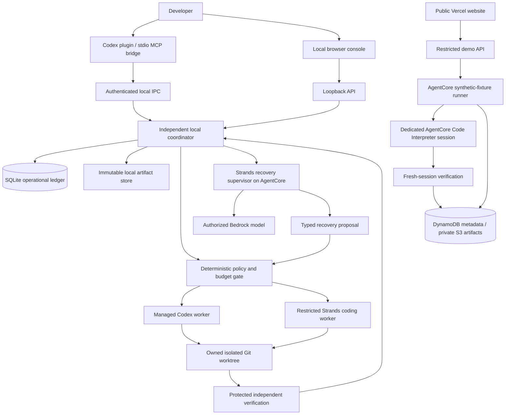

# 02 - Architecture and technical decisions

## 1. System shape

The diagram separates the real-user local execution plane from the public demonstration. There is no inbound cloud tunnel to the developer's Mac. The local coordinator invokes the cloud decision service over authenticated outbound HTTPS and executes only a revalidated decision.

## 2. Stack lock

| Layer | Choice | Reason |
|---|---|---|
| Local coordinator | Python 3.12, asyncio, FastAPI, Pydantic, uv | Same language as Strands; typed process and state control |
| Persistence | SQLite WAL, foreign keys, migrations; content-addressed files | No server required; durable local transactions |
| Codex adapter | Official Python SDK/app-server contract | Supported structured events and managed threads |
| Recovery reasoning | Strands Python + Bedrock | Required framework doing actual recovery judgment |
| Cloud decision runtime | Bedrock AgentCore | Authenticated, versioned deployment of the same supervisor |
| Fallback coding worker | Separate restricted Strands process | Independent from the primary coding host |
| MCP bridge | Official Python MCP SDK; stdio | Thin host integration; no survival guarantee required |
| UI packages | TypeScript, React, accessible Radix primitives, CSS tokens | Controlled composition rather than prebuilt dashboard styling |
| Local console build | Vite static client served by FastAPI | No extra local Next server |
| Public site | Next.js on Vercel | Marketing/docs, metadata, shareable public demo UI |
| Shared UI | A small workspace package | Local and hosted evidence views stay consistent |
| Cloud demo persistence | DynamoDB + private S3 | Durable metadata and bounded evidence artifacts |
| Infrastructure | AWS CLI/CDK + current AgentCore CLI | Repeatable provisioning and teardown |
| Testing/media | pytest, Playwright, axe, FFmpeg, Polly | Reproducible product proof and narrated demo |

Pin the latest mutually compatible stable package versions during the first capability gate. Do not specify invented future versions. Node must satisfy the chosen Next/Vite/AgentCore CLI versions. Use a supported current LTS release, then record its exact version.

## 3. Local service lifetime

Run one user-level daemon, managed by an explicit opt-in launchd agent on macOS. Installation writes only its own service label/config and application-support directory. It runs independently of Codex and the terminal. Foreground mode exists for development and Linux.

The plugin starts a short-lived stdio bridge that talks to a Unix domain socket with owner-only permissions. The bridge must not become the sole owner of work. The local web console is bound to `127.0.0.1` and requires a secure onboarding exchange/session, origin checks and CSRF protection. No wildcard CORS. Do not put long-lived bearer tokens in URLs.

If the Mac sleeps or powers off, local execution pauses. On wake/restart, reconcile processes, leases and snapshots before resuming. A cloud supervisor cannot read a sleeping laptop's filesystem. Remote execution of real repositories is a later, explicitly consented product extension.

## 4. Durable recovery algorithm

1. Persist the interruption signal with source event ID; deduplicate.
2. Check whether it was an intentional human stop. If yes, remain stopped.
3. Identify the owned worker by PID plus creation time and external run/thread ID.
4. Ask the adapter for graceful interruption. Wait for completion and descendant process termination. Use bounded escalation only on that owned process group. If uncertain, ask a human.
5. Enter CHECKPOINTING under a database transaction and lease-generation guard.
6. Snapshot the quiescent selected files to temporary artifacts. Hash them and fsync. Commit the artifact manifest only after atomic promotion.
7. Validate snapshot completeness, policy/task versions and redaction. If the last snapshot is incomplete, retain it for inspection but prohibit automatic restore.
8. Provide a bounded evidence envelope to the supervisor. Evidence-reading tools expose only records in this envelope or explicitly granted artifact IDs.
9. Validate its typed proposal. The deterministic guard separately evaluates authorization, budget reservation, scope, worker compatibility and policy.
10. If needed, create an expiring, single-use approval bound to the proposal digest.
11. Acquire the next workspace lease generation only after the previous writer is confirmed stopped.
12. Restore/validate into a distinct recovery worktree; dispatch one replacement using an idempotency token and an action outbox.
13. Persist worker-start acknowledgement before releasing dispatch state.
14. Run protected independent checks when the worker claims completion or reaches a verification milestone.
15. Finish with a verified receipt or a bounded retry/human decision. Max attempts are enforced in code.

Recovery dispatch is at-least-once messaging with effectively-once action through idempotency and reconciliation; do not claim mathematically exactly-once external execution.

## 5. Workspace strategy

Never have the autonomous worker modify the developer's active worktree. Create a detached dedicated worktree at the recorded base commit. Import only explicitly selected dirty changes and untracked files, with a manifest describing what was omitted. Respect ignore rules but do not blindly rely on `.gitignore` for secrets.

Use binary-safe, no-external-diff Git operations. Reject unsafe symlinks, submodule mismatches and missing Git LFS data until explicitly supported. Do not run textconv or repository-defined external filters to capture snapshots. Do not auto-stash, reset, change the developer's branch or force commits.

Record baseline tests before task changes. Place acceptance tests and their runner outside worker-writable paths, or mount them read-only in an execution sandbox. The managed worktree is not by itself a security sandbox; OS/container controls and minimal credentials remain necessary.

A filesystem watcher is a signal, not a durable log. Reconcile state by scanning the scoped manifest after quiet periods and at handoff boundaries. Files modified during a snapshot require retry or an inconsistent-snapshot status.

## 6. Snapshot persistence protocol

State artifacts live outside the source repository under the user's Dovet application data directory. Default permissions: parent 0700, local database and private artifact files 0600. SQLite is not inherently encrypted; describe FileVault/user-device encryption honestly. Optional application encryption is a separate feature, not an undocumented claim.

A snapshot includes a JSON manifest, approved file blobs or binary patch data, and a human-readable handoff. File blobs are addressed by SHA-256, size and kind. Relative paths use a canonical separator and cannot contain traversal, a drive prefix or NUL. Imported artifacts never contain executable restore hooks.

The file store and database commit use a staging directory and recovery journal. On reboot remove only orphaned temporary artifacts older than a safe threshold, never a valid checkpoint. A database row cannot become READY before every required blob is present and validated.

## 7. How Strands is genuinely used

The supervisor's tool loop can inspect a failed command, compare recent attempts, examine eligible workers and inspect task/policy summaries before producing a proposal. It chooses among meaningful alternatives; the local event loop is not relabelled "AI".

However, the model is not the trust authority. File permissions, budgets, operator approval, test-result interpretation and lease mutation remain deterministic. A single supervisor is enough. A separate coding worker is another execution role, not four ornamental agents calling each other.

The same supervisor module can run locally against Bedrock during development and in AgentCore for deployment. The submitted live path should invoke the deployed runtime and retain its trace/request ID. A mocked or merely configured deployment is not evidence of deployed execution.

## 8. Public live demo architecture

Use a fixed synthetic Python CSV-import fixture packaged with the demo. A bounded AgentCore demo invocation starts a child Strands worker, captures milestone state, intentionally terminates only that child on request, obtains a supervisor proposal and runs a replacement. Persist safe events and artifacts to dedicated DynamoDB/S3 storage. This demonstrates real recovery without hosting a visitor's code.

When an invocation must continue after the HTTP response, use the documented AgentCore async-task lifecycle and external durable status. Do not rely on a Python thread or temporary runtime filesystem as permanent state. Rehydrate from immutable artifacts after session loss. Live status polling reads DynamoDB, not a held Vercel request.

A short Lambda/API Gateway control surface may validate fixture-only requests and invoke AgentCore. Use a current AWS-supported invocation/authentication path. Validate this cloud vertical slice early. General arbitrary code execution would need stronger isolation, resource separation and security review; it is explicitly outside the public demo.

Public demo labels the real adapter names: Bedrock worker A -> fresh Bedrock worker B. The locally recorded Codex -> Bedrock path demonstrates the Codex integration. Do not label cloud workers Codex without actually using authorized Codex there.

### Cloud code execution boundary

The public demo's Strands worker may reason in the runtime, but generated fixture code must execute in a dedicated AgentCore Code Interpreter session, not inside the supervisor's credentialed Python process. Upload only the approved fixture and retrieve only bounded artifacts. Use a sandbox network configuration with an execution role that has no unnecessary AWS permissions; this mode can still allow limited AWS access, so do not call it fully offline. [S19]

Keep model invocation and source/test execution capabilities separate. Run final verification in a fresh controlled session from immutable source and protected suite artifacts. A worker does not receive a generic Code Interpreter or shell tool; Dovet's narrow tool layer maps approved operations to the session. Clean up sessions and budgets on stop/failure. If this isolation cannot be verified, disable the hosted live executor and provide a truthful local test build plus recorded evidence, rather than executing generated code in the web service.

## 9. Observability and cost

Structured event names, trace IDs, run IDs and checkpoint IDs link all systems. Redact log content before cloud upload. Keep billing/account identifiers out of public artifacts. Log decision summaries and evidence references, not private reasoning.

Token counts come from actual providers where available. Estimated costs reference a dated price card; do not combine missing numbers into a misleading total. Budget reservations prevent new work beyond a configured ceiling, but provider accounting latency/in-flight requests can create overrun. Show this limitation and add a safety margin.

Use an operator-approved build/demo budget. No assumed free AWS credits. CloudWatch retention and artifact TTLs must be explicit. A budget notification is not a hard kill switch; application dispatch limits and cancellation are separate controls.

## 10. Key architectural decisions

ADR-001: Plugin plus independent daemon, rather than plugin-only, because host lifecycle is the failure being survived.
ADR-002: Managed work first; arbitrary desktop sessions observation-only.
ADR-003: One Strands supervisor, deterministic guards, separate coding worker.
ADR-004: Local SQLite and content-addressed snapshots, not an unnecessary hosted relational database.
ADR-005: An internal `DovetCheckpoint/1` format, not a new "ACP" standard; ACP already names Agent Client Protocol.
ADR-006: Usage-aware handoff is optional. Process/crash recovery and verification must work without a quota API.
ADR-007: Immutable test evidence tied to source hash; no LLM-issued success flag.
ADR-008: Public fixture demo is separated from local execution and accurately labelled.
ADR-009: No persistent worker in the website hosting layer.
ADR-010: No cloud sync of real source by default. Consent is per provider and data category.
