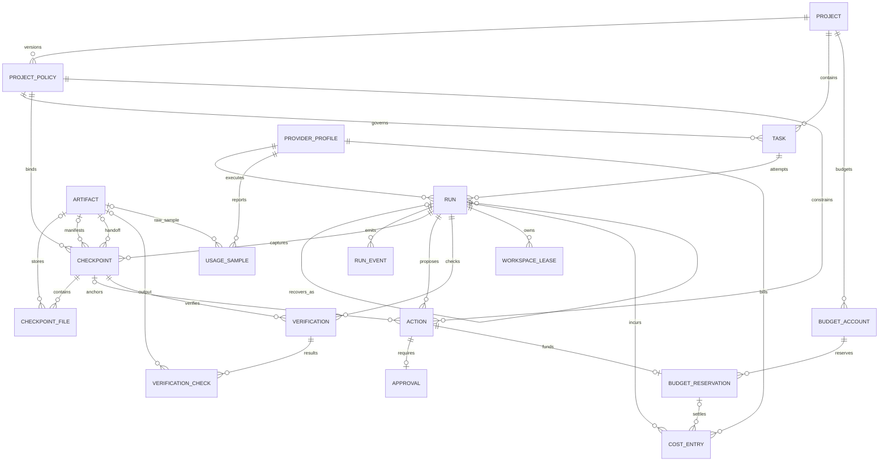

# 03 - Data model and ERD

`contracts/schema.sql` is an executable starting migration for the single-user local database. It uses SQLite foreign keys, JSON validity checks, uniqueness constraints and indexes. It is not a finished persistence implementation; Codex must add migration bookkeeping, transactions, row-to-domain conversion and integrity tests.

## Entity relationships



## Data dictionary

| Entity | Important properties and purpose |
|---|---|
| Project | Canonical root path/fingerprint, mode, trust state; never a credential container |
| Project policy | Immutable version, canonical digest and human approval; repository text cannot overwrite it |
| Provider profile | Adapter configuration, region/model, enabled state, keychain/AWS profile reference, capability probe |
| Task | Objective, version, scope and explicit acceptance checks |
| Run | One worker attempt; parent forms recovery lineage; actual external IDs and process identity |
| Run event | Ordered, deduplicated ledger; observed/reported/inferred/verified provenance |
| Artifact | Content digest, byte length, storage locator, redaction state and expiry |
| Checkpoint | Versioned immutable manifest, snapshot digest, completeness/validation state |
| Checkpoint file | Relative path, add/modify/delete/unchanged, mode and referenced immutable file bytes |
| Workspace lease | Exclusive writer generation, owner identity, heartbeat and old-writer termination evidence |
| Action | Typed recovery proposal, evidence IDs, policy-bound digest, dispatch outbox and idempotency token |
| Approval | Single-use decision, actor, nonce, expiry and source/action binding |
| Verification | Protected suite and candidate snapshot digests; aggregate result |
| Verification check | Exact trusted command ID/argv, criterion, exit code, duration and output artifact |
| Usage sample | Actual provider scope/window, observation time, percentage or unknown |
| Budget account | Approved project/time-window ceiling in integer micro-USD |
| Budget reservation | Atomic spend reservation for a specific dispatch |
| Cost entry | Reported, estimated or unknown; request-level deduplication and price-card provenance |

## Core invariants

Use opaque UUID identifiers; do not infer chronology from them. Store UTC RFC3339 timestamps and show localized times in the UI. Store duration from a monotonic clock. Money uses integer micro-USD; never floating point. Percentages are only provider measurements, never task-progress estimates.

The ERD deliberately has no organizations, invitations, subscriptions or CRM tables. Local identity is the signed-in operating-system user. The public demo has a separate storage scope. A future multi-tenant release must add tenant identity and enforce it across every data access, rather than bolting `user_id` onto this database and claiming isolation.

## Transaction boundaries

**Checkpoint ready:** file blobs staged and hashed -> manifest stored -> insert artifact/checkpoint/file rows together -> state ready. Do not commit a ready row before blob durability.

**Recovery authorization:** assert current task/policy/snapshot digests -> reserve budget -> acquire/advance confirmed-safe lease -> mark action authorized -> outbox dispatch. On failure, release only reservations known not to have caused a request. An uncertain provider request retains uncertain cost until reconciled.

**Approval consume:** pending approval must be approved, unexpired, matching digest and not previously consumed. Compare-and-swap to consumed in the same transaction that authorizes its bound action. Only the action ID, not a loose permission category, is approved.

**Verification success:** candidate source digest must still match before and after checks; protected suite digest must match its approved baseline; every required check passed. A later file edit invalidates the verification for that new snapshot.

## Integrity beyond SQL

The application must check cross-table project/task lineage on updates as well as inserts, permitted state transitions, immutable policy versions, absolute artifact-root containment, all export/import digests and budget sums under write transactions. SQL checks alone are insufficient. Add property tests for these constraints.

Never blindly retry an INSERT that dispatches a worker. Persist and query the idempotency token and actual external run ID. Recovery scans reconcile rows stuck in dispatching/checkpointing before starting new work.

## Artifact storage layout

```text
<Application Support>/Dovet/
  state.sqlite3
  ipc/service.sock
  objects/sha256/<first-two-hex>/<digest>
  staging/<operation-id>/
  worktrees/<project-id>/<run-id>/
  runtime/worker-identities.json
  logs/                       # sanitized, rotated
```

`worker-identities.json` is a recovery hint, not the authority; reconcile it with the database and operating system. Do not use a JSON file for live credential storage.

## Hosted demo representation

Do not copy the local SQLite file to a server or pretend it is synchronized. Use a dedicated DynamoDB table with keys such as `PK=DEMO#<session>`, `SK=RUN#<run>`, `EVENT#<sequence>`, `CHECKPOINT#<id>`, plus conditional writes and TTL. Blob pointers refer to a private S3 prefix bound to that demo session. Public responses omit internal ARNs and storage keys.

Public replay bundles are deliberately exported/redacted copies with a manifest, not public database dumps. Real user repository data is never mixed into the demo table.

## Retention

Default proposal: local run history 30 days, keep at least the most recent valid checkpoint for each unfinished task, and ask before removing a worktree with unreviewed changes. Cloud synthetic-run artifacts can expire after 24 hours except the pinned judged evidence bundle. Privacy/legal copy must reflect the configured retention, not aspirational defaults.

Implementation must provide a dry-run retention report, project export and explicit deletion. Avoid cascade deletion of original evidence while active actions reference it.
